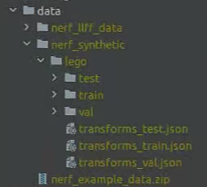

# NeRF code analyse

本次使用的 NeRF 实现是 pytorch 版的 NeRF，它的代码量并不是很大，并且代码文件较少，主要是熟悉一下数据格式和训练流程

参考文章：

# 总体流程:

- NeRF 虽然涉及了大量 CG 的知识，但是总体的流程还是深度学习的一个流程，只不过在实现方法中两种领域的知识几乎是各占一半，我们首先当以深度学习的角度去解读它

1. 读取数据：获取图片和对应的相机参数（变化坐标、俯仰角、屏幕尺寸、焦距）
2. 光线采样：根据相机参数，我们计算每个像素所对应的 camera ray
3. batch 训练：对所有的 ray 批采样
4. 渲染，求损失函数，再优化

- 采样是一个比较关键的点，NeRF 中的采样策略能够通过超参数来调节（是否使用粗糙-精细网络结构）
- NeRF 的数据也是比较关键的，通过了解数据的格式、内容，能够让我们训练出自己的数据，也是玩转 NeRF 的一个关键

# 数据

## 数据格式



NeRF 下的数据如上图所示，我们通过 lego 这个例子来解读：

test、train、val 中存放的是所需要的图片（即一个物体的不同视角）

transforms_xxx.json：

存放的是 camera2world 的转置矩阵（是世界坐标转相机坐标还是相机坐标转世界坐标？）

## 载入数据

```python
def train():

    _# 设置参数_
    parser = config_parser()
    args = parser.parse_args()
    
    ...
    
    elif args.dataset_type == 'blender':
            images, poses, render_poses, hwf, i_split = load_blender_data(args.datadir, args.half_res, args.testskip)
            print('Loaded blender', images.shape, render_poses.shape, hwf, args.datadir)
            i_train, i_val, i_test = i_split
                
                _# 设定边界框的远近边界_
            near = 2.
            far = 6.
                
                _# 将 RGBA 转换成 RGB 图像_
            if args.white_bkgd:
                    _# 如果使用白色背景_
                images = images[...,:3]*images[...,-1:] + (1.-images[...,-1:])
            else:
                images = images[...,:3]
```

在 NeRF 的 pytorch 实现中能够载入四种不同形式的数据，我们的 lego 模型则是 blender 这一 type 的，四种数据类型分别是：

- Blender
- llff
- LINEMOD
- Deepvoxel

观察上述代码的第十行，我们不难发现，数据的载入主要是在 load_blender_data()这个函数中的，我们进入这个函数的代码：

```python
def load_blender_data(basedir, half_res=False, testskip=1):
        """
        :param basedir: 数据文件夹路径
        :param half_res: 是否对图像进行半裁剪
        :param testskip: 挑选测试数据集的跳跃步长，以实现类似shuffer的效果？
        :return: 
        """
    splits = ['train', 'val', 'test']
    metas = {}
    for s in splits:
            # 分别加载三个 .json 文件，保存到字典中
        with open(os.path.join(basedir, 'transforms_{}.json'.format(s)), 'r') as fp:
            metas[s] = json.load(fp)

    all_imgs = []
    all_poses = []
    counts = [0]
    
    for s in splits:
        meta = metas[s]  # 加载 .json 文件中的内容
        imgs = []
        poses = []
        # 如果是 train 文件夹，连续读取图像数据
        if s=='train' or testskip==0:
            skip = 1
        else:
            skip = testskip
         
        for frame in meta['frames'][::skip]:
                # 以指定步长读取列表中的字典
            fname = os.path.join(basedir, frame['file_path'] + '.png')
            
            imgs.append(imageio.imread(fname))  # 将读取到的图像文件添加到图像列表中
            poses.append(np.array(frame['transform_matrix']))  # 读取转置矩阵
        imgs = (np.array(imgs) / 255.).astype(np.float32) # 此时 图像数组是一个 [n, H, W, 4] 的数组
        #【why 4？】 Answer： 
        poses = np.array(poses).astype(np.float32)  # [n, 4, 4]
        counts.append(counts[-1] + imgs.shape[0])  # 用于标定到train、test、val
        
        all_imgs.append(imgs)  # 包含了 train、test、val 的图像的列表
        all_poses.append(poses)
    
    i_split = [np.arange(counts[i], counts[i+1]) for i in range(3)]
    
    imgs = np.concatenate(all_imgs, 0)  # 把列表聚合称为一个数组 [N, H, W, 4]
    poses = np.concatenate(all_poses, 0)
    
    H, W = imgs[0].shape[:2]
    camera_angle_x = float(meta['camera_angle_x'])
    focal = .5 * W / np.tan(.5 * camera_angle_x)  # 计算焦距
    
    # 制作用于测试训练效果的 渲染pose
    render_poses = torch.stack([pose_spherical(angle, -30.0, 4.0) for angle in np.linspace(-180,180,40+1)[:-1]], 0)
    
    # 为了节省内存开销可以选择只加载一半的数据，这里不再展开解释
    if half_res:
        H = H//2
        W = W//2
        focal = focal/2.

        imgs_half_res = np.zeros((imgs.shape[0], H, W, 4))
        for i, img in enumerate(imgs):
            imgs_half_res[i] = cv2.resize(img, (W, H), interpolation=cv2.INTER_AREA)
        imgs = imgs_half_res
        # imgs = tf.image.resize_area(imgs, [400, 400]).numpy()

        
    return imgs, poses, render_poses, [H, W, focal], i_split
```

通过对代码的分析，可以得出返回值的含义：

- imgs : 根据 .json 文件加载到的所有图像数据。shape：（N，H，W，4）N 代表用于 train、test、val 的总数量
- poses : 转置矩阵。shape：（N，4，4）
- render_poses : 用于测试的 pose 。shape：（40，4，4）
- i_split : [[0:train], [train:val], [val:test]]
- [H，W，focal]：宽，高，焦距

# 模型初始化

得到了上一节的数据之后，我们透过 train（）函数的走向，可以发现下一步就是光线生成。

我们模拟的光线其实就是空间中一组离散的点坐标，通过这组点坐标，我们就能够利用 NeRF 的 MLP 生成对应点的密度和颜色

## train

我们跟随 train（）函数的代码往下推进

```python
def train():
        ...
        # 加载数据
        ...
        
    if K is None:
       K = np.array([
           [focal, 0, 0.5*W],
           [0, focal, 0.5*H],
           [0, 0, 1]
       ])
    #这个K是相机的内参，作用：focal就是焦距，0.5W，0.5H就是图像的原点
```

初始化 NeRF 网络：

```python
def train():
        ...
        # 初始化 NeRF 网络模型
        render_kwargs_train, render_kwargs_test, start, grad_vars, optimizer = create_nerf(args)

        bds_dict = {
        'near' : near,
        'far' : far,
    }
    # 更新字典，加入三维空间的边界框 bounding box
    render_kwargs_train.update(bds_dict)
    render_kwargs_test.update(bds_dict)
        ...
```

### create_nerf

初始化主要通过函数 create_nerf（）实现，我们接着进入 create_nerf（）的代码

```python
def create_nerf(args):
    embed_fn, input_ch = get_embedder(args.multires, args.i_embed)  
        ...
```

这个 get_embedder 函数对应的就是论文中的位置编码部分，给定返回的编码器 embed_fn 一个输入，就能够获得编码后的结果，公式如下（位置编码公式）：


#### get_embedder

该函数的具体实现：

```python
def get_embedder(multires, i=0):

    if i == -1:
        return nn.Identity(), 3 #原封不动返回，不进行编码
    
    embed_kwargs = {
                'include_input' : True,  # <u>如果为真，最终的编码结果包含原始坐标</u>
                'input_dims' : 3,  # 输入给编码器的数据的维度
                'max_freq_log2' : multires-1,
                'num_freqs' : multires,  # 即论文中 5.1 节位置编码公式中的 L 
                'log_sampling' : True,
                'periodic_fns' : [torch.sin, torch.cos],
    }
    
    embedder_obj = Embedder(**embed_kwargs)
    embed = lambda x, eo=embedder_obj : eo.embed(x)  # embed 现在相当于一个编码器，具体的编码公式与论文中的一致。
    return embed, embedder_obj.out_dim

class Embedder:
    def __init__(self, **kwargs):
        self.kwargs = kwargs
        self.create_embedding_fn()
        
    def create_embedding_fn(self):
        embed_fns = []
        d = self.kwargs['input_dims']
        out_dim = 0
        
        # 如果包含原始位置
        if self.kwargs['include_input']:
            embed_fns.append(lambda x : x)  # 把一个不对数据做出改变的匿名函数添加到列表中
            out_dim += d
            
        max_freq = self.kwargs['max_freq_log2']
        N_freqs = self.kwargs['num_freqs']
        
        if self.kwargs['log_sampling']:
            freq_bands = 2.**torch.linspace(0., max_freq, steps=N_freqs)  # 得到 [2^0, 2^1, ... ,2^(L-1)] 参考论文 5.1 中的公式
        else:
            freq_bands = torch.linspace(2.**0., 2.**max_freq, steps=N_freqs)  # 得到 [2^0, 2^(L-1)] 的等差数列，列表中有 L 个元素
            
        for freq in freq_bands:
            for p_fn in self.kwargs['periodic_fns']:
                embed_fns.append(lambda x, p_fn=p_fn, freq=freq : p_fn(x * freq))  # sin(x * 2^n)  参考位置编码公式
                out_dim += d  # 每使用子编码公式一次就要把输出维度加 3，因为每个待编码的位置维度是 3
                    
        self.embed_fns = embed_fns  # 相当于是一个编码公式列表
        self.out_dim = out_dim
        
    def embed(self, inputs):
    # 对各个输入进行编码，给定一个输入，使用编码列表中的公式分别对他编码
        return torch.cat([fn(inputs) for fn in self.embed_fns], -1)
```

#### 初始化网络结构

```python
def create_nerf(args):
        ...
        # 初始化MLP模型参数，网络的层级模型详见论文 补充材料 pic 7
    model = NeRF(D=args.netdepth, W=args.netwidth, #网络的宽度和深度都是可以从超参数中定义的
                 input_ch=input_ch, output_ch=output_ch, skips=skips,
                 input_ch_views=input_ch_views, use_viewdirs=args.use_viewdirs).to(device)
    # 模型中的梯度变量
    grad_vars = list(model.parameters())
    ...
    # 定义一个查询点的颜色和密度的匿名函数，实际上给定点坐标，方向，以及查询网络，我们就可以得到该点在该网络下的输出（[rgb,alpha]）
    network_query_fn = lambda inputs, viewdirs, network_fn : run_network(inputs, viewdirs, network_fn,
                                                                embed_fn=embed_fn,
                                                                embeddirs_fn=embeddirs_fn,
                                                                netchunk=args.netchunk  # 网络批处理查询点的数量)
```

这里就来到了我们的第一个 MLP 映射：通过 5D 输入获得颜色和密度的映射


在代码中为 run_network()函数，这是一个匿名函数，network_fn 变量就是我们的 model 变量，接下来我们分析 run_network()函数

##### run_network

```python
def run_network(inputs, viewdirs, fn, embed_fn, embeddirs_fn, netchunk=1024*64):
    """
    对 input 进行处理，应用 神经网络 fn
    """
    inputs_flat = torch.reshape(inputs, [-1, inputs.shape[-1]])
        embedded = embed_fn(inputs_flat)  # 对输入进行位置编码，得到编码后的结果，是一个 array 数组

        if viewdirs is not None:
                # 视图不为 None，即输入了视图方向，那么我们就应该考虑对视图方向作出处理，用以生成颜色
                input_dirs = viewdirs[:, None].expand(inputs.shape)
                input_dirs_flat = torch.reshape(input_dirs, [-1, input_dirs.shape[-1]])
                embedded_dirs = embeddirs_fn(input_dirs_flat)  # 对输入方向进行编码
                embedded = torch.cat([embedded, embedded_dirs], -1)  # 将编码后的位置和方向聚合到一起

        outputs_flat = batchify(fn, netchunk)(embedded)  # 将编码过的点以批处理的形式输入到 网络模型 中得到 输出（RGB,A）
        outputs = torch.reshape(outputs_flat, list(inputs.shape[:-1]) + [outputs_flat.shape[-1]])
        return outputs
```

这里就是一个将输入的数据编码然后输入到 network 中的，不过为什么我们需要专门定义一个匿名函数来实现这样一个过程了，除了代码的美观性，我认为和 NeRF 原文中的 coarse to fine 有关，我们需要定义两个网络模型，所以输入的网络也是不同的。

#### 初始化完成

我们接着来到 create_nerf（）函数中

```python
def create_nerf(args):
        ...
        # 创建网络的优化器
    optimizer = torch.optim.Adam(params=grad_vars, lr=args.lrate, betas=(0.9, 0.999))
        
        ...
        # 关于加载已有模型的部分我们不在逐行分析，对整体算法的分析没有任何影响
        # 此处忽略了精细网络的加载过程
        ...
        
        # 注意看，现在整体的初始化已经完成，我们需要对返回值进行一些处理
        render_kwargs_train = {
        'network_query_fn' : network_query_fn,
        'perturb' : args.perturb,
        'N_importance' : args.N_importance,
        'network_fine' : model_fine,
        'N_samples' : args.N_samples,
        'network_fn' : model,
        'use_viewdirs' : args.use_viewdirs,
        'white_bkgd' : args.white_bkgd,
        'raw_noise_std' : args.raw_noise_std,
    }

    # NDC 空间，只对前向场景有效，具体解释可以看论文，这里不再展开
    if args.dataset_type != 'llff' or args.no_ndc:
        print('Not ndc!')
        render_kwargs_train['ndc'] = False
        render_kwargs_train['lindisp'] = args.lindisp

    render_kwargs_test = {k : render_kwargs_train[k] for k in render_kwargs_train}
    render_kwargs_test['perturb'] = False
    render_kwargs_test['raw_noise_std'] = 0.

    return render_kwargs_train, render_kwargs_test, start, grad_vars, optimizer
```

对 render_kwargs_train 进行分析：

- 'network_query_fn' : network_query_fn

  - 上文已经解释过了，这是一个匿名函数，
  - 给这个函数输入位置坐标，方向坐标，以及神经网络，就可以利用神经网络返回该点对应的 颜色和密度
- 'perturb' : args.perturb

  - 扰动，对整体算法理解没有影响
- 'N_importance' : args.N_importance

  - 每条光线上细采样点的数量
- 'network_fine' : model_fine

  - 论文中的 精细网络
- 'N_samples' : args.N_samples

  - 每条光线上粗采样点的数量
- 'network_fn' : model

  - 论文中的 粗网络
- 'use_viewdirs' : args.use_viewdirs

  - 是否使用视点方向，影响到神经网络是否输出颜色
- 'white_bkgd' : args.white_bkgd

  - 如果为 True 将输入的 png 图像的透明部分转换成白色
- 'raw_noise_std' : args.raw_noise_std

  - 归一化密度

**在齐次裁剪空间的基础上进行透视除法（perspective division)或称齐次除法（homogeneous division),得到的坐标叫做 NDC 空间坐标。**

标准化设备坐标(Normalized Device Coordinates, NDC)

# 光线生成

经过前面读入数据和模型初始化之后，我们开始设置光线的操作，解读到现在，我们的基本流程如下所示：

```python
def train():
        
        # 1、加载数据
        if args.dataset_type == 'llff':
        elif ...
        ...

        # 2、初始化网络模型
        render_kwargs_train, render_kwargs_test, start, grad_vars, optimizer = create_nerf(args)
        ...
        
        if args.render_only: ...
```

这里的 arg.render_only: 当我们设置为 True 时，网络就不再进行训练，而是使用训练好了的模型进行渲染，直接得到渲染结果。

下面开始光线生成的代码内容：

```python
def train():

        ...
        
        # 开始读取光线以及光线对应的像素值
        N_rand = args.N_rand
        # 是否以批处理的形式生成光线
    use_batching = not args.no_batching
    if use_batching:
        print('get rays')
        rays = np.stack([get_rays_np(H, W, K, p) for p in poses[:,:3,:4]], 0) # [N, ro+rd, H, W, 3]
        print('done, concats')
        rays_rgb = np.concatenate([rays, images[:, None]], 1)  # [N, ro+rd+rgb, H, W, 3]  这里把光线的原点、方向、以及这条光线对应的像素颜色结合到一起，便于后面的 shuffle 操作
        rays_rgb = np.transpose(rays_rgb, [0,2,3,1,4])  # [N, H, W, ro+rd+rgb, 3]
        rays_rgb = np.stack([rays_rgb[i] for i in i_train], 0)  # train images only
        rays_rgb = np.reshape(rays_rgb, [-1,3,3])  # [(N-1)*H*W, ro+rd+rgb, 3]
        rays_rgb = rays_rgb.astype(np.float32)
        print('shuffle rays')
        np.random.shuffle(rays_rgb)

        print('done')
        i_batch = 0
```

例子中的 lego 小车中 use_batching = False,不过了解这部分函数也会带来收获，我们通过 print()中的内容不难发现主要实现是这个 get_rays_np()函数实现了生成，我们进入到 get_rays_np 函数中：

```python
def get_rays_np(H, W, K, c2w):
    i, j = np.meshgrid(np.arange(W, dtype=np.float32), np.arange(H, dtype=np.float32), indexing='xy')
    dirs = np.stack([(i-K[0][2])/K[0][0], -(j-K[1][2])/K[1][1], -np.ones_like(i)], -1)
    # Rotate ray directions from camera frame to the world frame
    rays_d = np.sum(dirs[..., np.newaxis, :] * c2w[:3,:3], -1)  # dot product, equals to: [c2w.dot(dir) for dir in dirs]
    # Translate camera frame's origin to the world frame. It is the origin of all rays.
    rays_o = np.broadcast_to(c2w[:3,-1], np.shape(rays_d))
    return rays_o, rays_d
```

np.meshgrid(a, b，indexing = "xy") 函数会返回 b.shape() 行 ，a.shape() 列的二维数组。因此 i, j 都是 [H, W] 的二维数组。i 的每一行代表 x 轴坐标，j 的每一行代表 y 轴坐标。如此一来我们得到了一个图片的每个像素点的坐标。同时我们还能对横坐标和纵坐标进行单独的操作。

接下来就是使用前文中提到的相机内参来计算每个像素坐标相对于光心的单位方向

```python
dirs = np.stack([(i-K[0][2])/K[0][0], -(j-K[1][2])/K[1][1], -np.ones_like(i)], -1)
"""
#K = np.array([
           #[focal, 0, 0.5*W],
           #[0, focal, 0.5*H],
           #[0, 0, 1]
i是存储x坐标的二维数组，j是存储y坐标的数组
上面的操作相当于是让每个坐标减去了光心的坐标，然后除以焦距
那么这样做的实际意义是什么呢
我们相当于得到了一个方向向量（（i-W/2）/f，-(j-H/2)/f）
这里的Y是负数，而X不是，这一问题查阅了许久，最终发现：
原输入的是opencv坐标系下的图像，而我们需要转化为opengl坐标下的图像，此时我们的y，z都需要反转（这里还是不太清楚具体原因，还需要查资料）
"""
```

## 开始训练

在前面的部分，我们完成了数据的载入、模型的初始化、生成了所有图片的光线原点以及方向，接下来我们就可以开始模型的训练了。

```c
def train():
        ...
        
        # 4、开始训练
        for i in trange(start, N_iters):
                
                if use_batching:
                        ...
                else: 
                        ...
```

# 问题总结：
